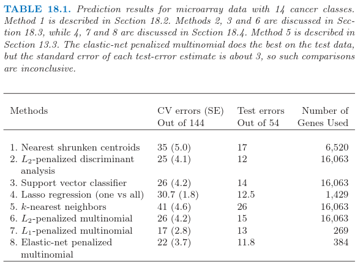

# 二次正则化的线性分类器

| 原文   | [The Elements of Statistical Learning](../book/The Elements of Statistical Learning.pdf) |
| ---- | ---------------------------------------- |
| 翻译   | szcf-weiya                               |
| 时间   | 2017-04-27:2017-04-27                    |
|更新| 2017-08-09, 2017-12-29|

Ramaswamy et al. (2001)[^1]提出一个更加困难的微阵列分类问题，涉及144个病人的14种癌症类型的训练集，以及含有54个病人的测试集。已知16063个基因的表达值。

表18.1显示了通过8个不同的分类方法得到的预测结果。每个病人的数据首先经过标准化后使得均值为0，方差为1；似乎提高了整个例子的预测正确性，表明每个基因表达谱的形状是很重要的，而不是表达的绝对水平。在每种情形中，正则参数的选取使得交叉验证误差最小，并且展现了每个参数值的测试误差。当有多余一个的正则参数得到最小的交叉验证误差，报告该值对应的测试误差的平均值。

RDA(正则判别分析)，正则多元逻辑斯底回归，以及支持向量机是更复杂的方法，试图研究数据的多变量信息。我们依次描述每个方法，以及一系列正则化方法，包括$L_1$和 $L_2$，以及两个都有的方法。

## 正则化判别分析

正则化判别分析(RDA)在4.3.1节已经描述。线性判别分析涉及$p\times p$类间协方差阵的逆。当$p >> N$，该矩阵可以很大，秩至多为$N < p$，因此是奇异矩阵。RDA克服了对类间协方差矩阵的估计$\hat\Sigma$正则化的问题。这里我们采用一个将$\hat\Sigma$收缩到其对角阵版本的RDA：

$$
\hat\Sigma(\gamma) = \gamma\hat\Sigma + (1-\gamma) diag(\hat\Sigma), \;\text{with}\; \gamma\in [0,1]\qquad (18.9)
$$

!!! note "Recall"
    $$
    \hat\Sigma_k(\alpha)=\alpha\hat\Sigma_k+(1-\alpha)\hat\Sigma\qquad (4.13)
    $$
    $$
    \hat\Sigma(\gamma)=\gamma\hat\Sigma+(1-\gamma)\hat\sigma^2I\qquad (4.14)
    $$

注意到$\gamma = 0$对应对角LDA，也是最近收缩重心的“无收缩”版本。(18.9)的收缩形式很像岭回归(3.4.1节)，将整个特征的协方差矩阵收缩到对角（标量值）矩阵。实际上，将线性判别分析看成是类别响应变量的最优得分的线性回归（见12.6节的(12.57)），这个等价性变得更加精确。

求大型$p\times p$矩阵逆的计算负担通过采用18.3.5节的方法可以克服。$\gamma$的值通过交叉验证取为表18.1中第二行的值；所有$\gamma\in(0.002,0.550)$给出了相同的CV和测试误差。RDA进一步的发展，除了协方差矩阵还包括重心的收缩，可以在Guo et al. (2006)[^2]的工作中找到。

## 二次正则的逻辑斯底回归

逻辑斯底回归(4.4节)可以用相似的方式进行改进用来处理$p >> N$的情形。在$K$个类别的情形下，我们采用p119的多类别逻辑斯底回归模型(4.17):

$$
Pr(G=k\mid X=x)=\frac{exp(\beta_{k0}+x^T\beta_k)}{\sum_{\ell=1}^Kexp(\beta_{\ell0}+x^T\beta_\ell)}\qquad (18.10)
$$

这有$K$个对数几率参数$\beta_1,\beta_2,\ldots,\beta_K$的系数向量。我们通过最大化惩罚的对数似然来正则化拟合

$$
\underset{\{\beta_{0k},\beta_k\}_1^K}{max}[\sum\limits_{i=1}^NlogPr(g_i\mid x_i)-\frac{\lambda}{2}\sum\limits_{k=1}^K\Vert\beta_k\Vert]_2^2\qquad (18.11)
$$

正则化自动解决了参数化中的冗余，并且使得$\sum_{k=1}^K\hat\beta_{kj}=0,j=1,\ldots,p$(练习18.3)。注意到常数项$\beta_{k0}$没有正则化（并且应该被设成0）。结果得到的优化问题是凸的，而且可以通过牛顿算法或者其他数值技巧求解。详细细节在Zhu and Hastie(2004)[^3]的工作中给出。Friedman et al.(2010)[^4]提供了计算两个和多个类别逻辑斯底回归模型的正则化路径的软件。表18.1，第6行报告了多重类别逻辑斯底回归模型的结果，称之为“多项式”。可以证明(Rosset et al., 2004a[^5])，对于可分数据，当$\lambda\rightarrow 0$，正则（两个类别）逻辑斯底回归估计（重标准化）收敛到最大边界分类器(maximal margin classifier)(12.2节)。这给出了支持向量机的一种受欢迎的替代方式，特别是在多重类别的情形中，这将在下面讨论。

## 支持向量分类器

两个类别情形的支持向量机在12.2节中讨论。当$p > N$时，特别受欢迎， 因为一般情形下类别是可以被超平面完全可分的，除非在不同类别中有相同的特征向量。没有任何正则化，支持向量分类器寻找具有最大空白的分离超平面；也就是，超平面得到训练数据之间最大的间距。有点吃惊的是，当$p >> N$时未正则化的支持向量机通常和最优正则版本表现得一样好。过拟合经常似乎不是一个问题，部分是因为误分类损失的不敏感性。

有许多不同的方式将两个类别的支持向量分类器推广为$K > 2$个类别的情形。在一对一方法(ovo)中，我们计算所有的$\binom{K}{2}$成对分类器。对每个测试点，预测类别是在大多数成对比较中获胜的那个。在一对多方法(ova)中，每个类别与所有的其他类别在K次两类别比较中进行比较。为了对某个测试点分类，我们计算$K$个分类器中的每一个计算置信度（到超平面的符号距离）。胜利者是有最高置信度的类别。最后，Vapnik(1998)[^6]，Weston and Watins(1999)[^7]提出推广两类别准则(12.7)的（有点复杂）多重类别准则。

Tibshirani and Hastie（2007）[^8]提出边际树(margin tree)分类器，这是支持向量分类器用在二叉树中，很像在CART（第9章）中一样。类别以分层形式进行组织，举个例子，对于将病人分类成不同的癌症类型是很有用的。

表18.1的第三行显示了支持向量机采用ova方法的结果，Ramaswamy et al. (2001)[^1]报告了（并且我们证实了）这个方法对于这个问题表现得很好。误差与第6行的误差很相似，正如我们在上一节的最后做出的评论那样。误差率对$C$的选择不是很敏感[p420中式(12.8)的正则化参数]，对于值$C > 0.001$.因为$p > N$，支持向量超平面可以通过设置$C=\infty$完美地分离训练数据。

## 特征选择

当$p$值很大时，特征选择对于分类器来说是很重要的科学要求。判别分析、逻辑斯底回归，以及支持向量分类器都不能自动表现出特征选择，因为它们都用到了二次正则化。在这些模型中所有特征都有非零权重。举个例子，已经提出的用于特征选择的Ad-hoc方法，除掉系数较小的基因，然后重新拟合分类器。这可以用一种向后逐步的方式进行，以最小的权重开始，然后移动到较大的权重上去。这被称作递归特征消去(recursive feature elimination)(Guyon et. al，2002[^1])。在这个例子中，不是很成功；Ramaswamy et al.（2001）[^1]称，举个例子，支持向量分类器的正确性随着基因数目（从全集16063开始）的下降而退化。这是非常重要的，因为训练样本的数目只有44个。我们对这个表现病没有一个解释。

本节讨论的三个方法（RDA，LR，SVM）可以修改为用核来拟合非线性判别边界。通常这种方法的目的是增加模型的复杂度。当$p > > N$，模型已经充分复杂，并且过拟合通常是很危险的。然而尽管高维度，径向核（12.3.3节）有时在这些高纬问题中表现出更好的结果。径向核趋向于抑制相距很远的点之间的内积，反过来导致离群点很鲁棒。这通常发生在高纬的情形中，并且或许可以解释积极的结果。我们在表18.1中对svm试了一种径向核，但是这种情形下表现不好。

## 当$p>>N$时的计算捷径

这一节中讨论的计算技巧可以应用到任何对参数二次正则化的线性模型拟合中。这包含这节中讨论的所有方法，以及其他更多的方法。当$p > N$时，通过在14.5节中介绍的奇异值分解方法，计算可以在$N$维空间中进行，而不是$p$。这里是几何上的直观：恰恰像三维空间中两点总是在一条直线上一样，在$p$维空间中的$N$个点位于$(N-1)$维仿射子空间中。

给定$N\times p$的数据矩阵$\mathbf X$，令

$$
\begin{array}{ll}
\mathbf X & = \mathbf {UDV^T}\quad (18.12)\\
& = \mathbf{RV^T}\qquad (18.13)
\end{array}
$$

为$\mathbf X$的奇异值分解；也就是，$\mathbf V$是有着正交列的$p\times N$矩阵，$\mathbf U$是 $N\times N$正交矩阵，$\mathbf D$是元素为$d_1\ge d_2\ge d_N\ge 0$的对角矩阵。矩阵$\mathbf R$是 $N\times N$的，列为$r_i^T$.

举个简单的例子，我们首先考虑岭回归估计

$$
\hat\beta = (\mathbf{X^TX}+\lambda\mathbf I)^{-1}\mathbf{X^Ty}\qquad (18.14)
$$

用$\mathbf RV^T$替换$\mathbf X$，并且进行一些运算，可以证明它等于

$$
\hat\beta = \mathbf{V(R^TR+\lambda I)^{-1}\mathbf{R^Ty}}\qquad (18.15)
$$

（练习18.4）。因此$\hat\beta = \mathbf V\hat\theta$，其中$\hat\theta$是采用$N$个观测$(r_i,y_i),i=1,2,\ldots,N$的岭回归估计。换句话说，我们可以简单地将数据矩阵从$\mathbf X$降维成$\mathbf R$，并且对$\mathbf R$的行进行操作。这个技巧将$p > N$时的计算花费从$O(p^3)$降为$O(pN^2)$

这些结果可以推广到所有参数为线性并且有二次惩罚的模型。考虑任意的监督学习问题，我们采用线性函数$f(X)=\beta_0+X^T\beta$来建立条件分布$Y\mid X$的参数模型。我们通过在数据上最小化损失函数$\sum_{i=1}^NL(y_i,f(x_i))$和 $\beta$上的二次惩罚来拟合参数$\beta$。逻辑斯底回归是个很有用的例子。接着我们有下面简单的定理：

>令$f^\*(r_i)=\theta_0+r_i^T\theta$， $r_i$ 如(18.13)定义，并且考虑成对优化问题：
>
>$$
\begin{array}{ll}
(\hat\beta_0,\hat\beta) &= arg\underset{\beta_0,\beta\in R^p}{min}\sum\limits_{i=1}^NL(y_i,\beta_0+x_i^T\beta)+\lambda\beta^T\beta\qquad (18.16)\\
(\hat\theta_0,\hat\theta) &= arg\underset{\theta_0,\theta\in R^N}{min}\sum\limits_{i=1}^NL(y_i,\theta_0+r_i^T\theta)+\lambda\theta^T\theta\qquad (18.17)
\end{array}
$$
>于是有$\hat\beta_0=\hat\theta_0, \hat\beta=\mathbf V\hat\theta$.

这个定理说我们可以用$N$维的向量替换$p$维向量，并且像之前一样进行带惩罚的拟合，但是有更少的预测变量。$N$维向量的解$\hat\theta$接着通过简单的矩阵运算转化为$p$维向量的解。这个结果是统计学传说之一，理应当被广泛知道——更多细节详见Hastie and Tibshirani(2004)等人的工作。

几何上，我们把特征旋转到除了前$N$个坐标分量其余分量都为0的坐标系中。这个旋转是允许的，因为二次惩罚在旋转下是不变的，并且线性模型是等价的。

这个结果可以应用到本章中讨论的许多学习算法，比如正则化（多类别）逻辑斯底回归，线性判别分析（练习18.6），以及支持向量机。这也应用到有二次正则化的神经网络（11.5.2节）。然而，注意到，这并不应用到类似lasso的方法中，这些方法对系数加的是非平方惩罚（$L_1$）。

一般地，我们采用交叉验证去选择参数$\lambda$。可以看到（练习18.12）我们仅需要对原始数据构造一次$\mathbf R$，并且用这个作为每个CV折的数据。

12.3.7节中的支持向量机的“核技巧”在不同的情形下利用了这节中的降维。假设我们有$N\times N$的（内积）矩阵$\mathbf{K=XX^T}$。由（18.12）我们有$\mathbf{K=UD^2U^T}$，所以$\mathbf K$捕捉了与$\mathbf R$一样的信息。练习18.13显示了我们怎样在这节中利用这个想法用$\mathbf K$和它的SVD分解来拟合岭逻辑斯底回归。

[^1]: Ramaswamy, S., Tamayo, P., Rifkin, R., Mukherjee, S., Yeang, C., Angelo, M., Ladd, C., Reich, M., Latulippe, E., Mesirov, J., Poggio, T., Gerald, W., Loda, M., Lander, E. and Golub, T. (2001). Multiclass cancer diagnosis using tumor gene expression signature, PNAS 98: 15149–15154.
[^2]: Guo, Y., Hastie, T. and Tibshirani, R. (2006). Regularized linear discriminant analysis and its application in microarrays, Biostatistics 8: 86–100.
[^3]: Zhu, J. and Hastie, T. (2004). Classification of gene microarrays by penalized logistic regression, Biostatistics 5(2): 427–443.
[^4]: Friedman, J., Hastie, T. and Tibshirani, R. (2010). Regularization paths for generalized linear models via coordinate descent, Journal of Statistical Software 33(1): 1–22.
[^5]: Rosset, S., Zhu, J. and Hastie, T. (2004a). Boosting as a regularized path to a maximum margin classifier, Journal of Machine Learning Research 5: 941–973.
[^6]: Vapnik, V. (1998). Statistical Learning Theory, Wiley, New York.
[^7]: Weston, J. and Watkins, C. (1999). Multiclass support vector machines, in M. Verleysen (ed.), Proceedings of ESANN99, D. Facto Press, Brussels.
[^8]: Tibshirani, R. and Hastie, T. (2007). Margin trees for high-dimensional classification, Journal of Machine Learning Research 8: 637–652.
