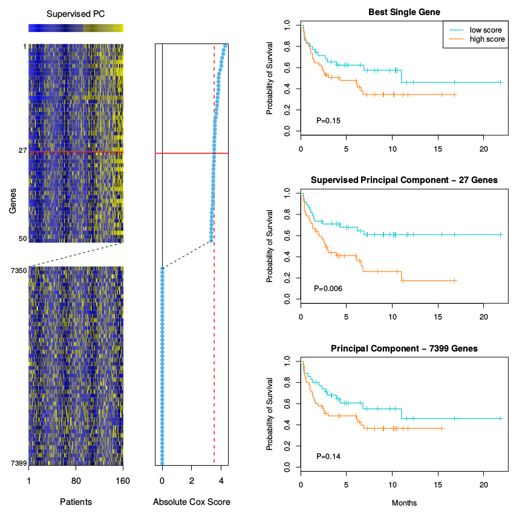
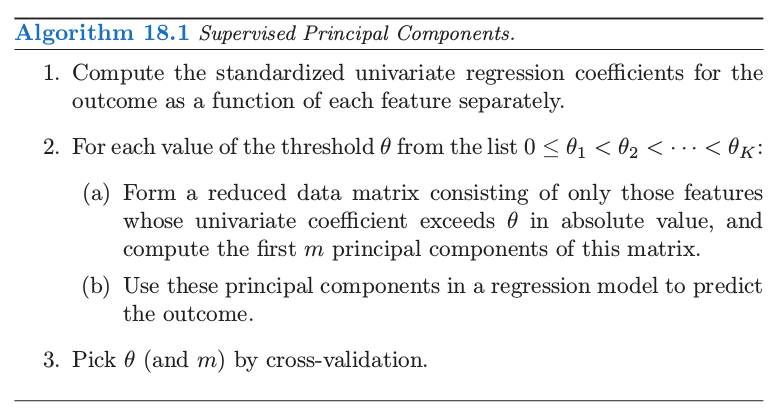

# 高纬回归: 有监督的主成分

| 原文   | [The Elements of Statistical Learning](../book/The Elements of Statistical Learning.pdf) |
| ---- | ---------------------------------------- |
| 翻译   | szcf-weiya                               |
| 时间   | 2017-08-17                    |

这一节中我们将要描述一种实现回归和广义回归的简单方式, 在$p>>N$情形下特别有用. 我们用另外一个微阵列数据的例子来解释这一方法. 数据取自Rosenwald等人在2002年的工作, 其中包含240个患有DLBCL的病人, 有7399个基因表达水平的测量值. 输出变量为生存时间, 取值为"observed" 或者"right censored." 我们将样本随机分成大小为160的训练集和大小为80的测试集.

尽管有监督的主成分适合线性回归, 但是它最有趣的应用也许是生存分析, 这也将是这个例子所要关注的地方.

<!--
!!! note "censored survival data"
    个人理解是, 数据中无对应的记录值, 也就是只有部分个体有*生存时间*的记录值, 而其他个体没有记录值.[NEED VERIFIED!!]

-->

我们还没有在这本书中讨论censored survival数据的回归问题; 它表示了一种回归的一般形式, 输出变量(生存时间)只对一部分个体有观测. 举个例子我们实施一项持续365天的医学研究, 为了简便起见, 所有的项目在第一天完成. 我们可能会观测到研究开始后有个体200天后死亡, 而也有个体当研究结束后还活着. 这个个体则称为365天"right censored". 我们仅仅知道他/她至少活了365天. 尽管我们并不知道过了多久该个体会死去, 但"censored"观察值仍然很有意义. 图18.11 诠释了这一意义. 图18.12 显示了对测试集中的80个病人应用Kaplan–Meier方法估计得到的生存曲线. 关于Kaplan–Meier方法的描述可以参见Kalbfleisch and Prentice(1980)年的例子.

!!! note "预后(prognostic)"
    预后是指预测疾病的可能病程和结局。它既包括判断疾病的特定后果（如康复，某种症状、体征和并发症等其它异常的出现或消失及死亡）；也包括提供时间线索，如预测某段时间内发生某种结局的可能性。由于预后是一种可能性，主要指病人群体而不是个人。从疾病演进过程的角度划分， 预后的量度有缓解率、 复发率、病残率等； 从疾病终极状态的角度划分， 预后的量度有治愈率、生存率、病死率等. (refer to www.bing.com)

这个例子中我们的目标是寻找可以预测一组独立病人个体的生存时间的特征(基因)集合. 这个可以作为一个预后指示变量来帮助选择治疗方案, 或者帮助理解这个疾病的生理基础.

有监督的主成分的潜在概念模型如图18.13所示. 我们猜想存在两种类型的细胞, 拥有好细胞的病人平均会活得久一些. 然而, 两者之间存在相当大部分的重叠. 我们可能将存活时间作为细胞类型的有噪声的代理变量("noisy surrogate"). 全监督方法会赋予那些与生存有关的基因最多的权重. 这些基因与细胞类型部分相关(但不是完全). 换种方式,如果我们能够发现病人潜在的细胞类型, 它经常受到在通路中相当多的基因一起作用的影响, 或许在预测病人的生存方面取得更好的结果.

尽管图18.13中的细胞类型是离散的, 但假设其为连续的是有用的, 它定义为特征的某些线性组合. 我们将会把细胞类型作为连续值来估计, 接着为了展示和解释的需要进行离散化.

我们应该怎样寻找这个定义了潜在细胞类型的线性组合? 第14.5节的主成分分析是一个用来发现数据集中表现出大方差的特征的线性组合. 但是我们这里需要寻找的是高方差以及与响应变量有显著相关性的线性组合. 图18.14的右下图显示了在这个例子中应用标准的主成分的结果; 第一主成分与生存时间的相关性并不是很高.

因此我们想要主成分分析寻找到与输出有高相关的特征的线性组合. 为了实现这一点, 我们限制在那些本身就与输出变量存在高相关性的变量上. 这已经总结在了算法18.1中, 并且在图18.14中做了解释.

算法中第(1)和第(2b)步的细节取决于输出变量的类型. 对于标准的回归问题, 我们在步骤(1)中采用单变量的线性最小二乘系数, 在第(2b)步采用线性的最小二乘模型. 对于生存分析问题, Cox的比例风险回归(proportional hazards regression) 被广泛使用; 因此这里在第(1)步, 我们采用模型的得分检验, 在第(2b)步中采用多变量Cox模型. 具体细节对于理解这一基本方法不重要; 它们可以在Bair等人在2006年的工作中找到.

图18.14展示了这个例子中有监督的主成分的结果. 我们采用3.53作为Cox得分的分割点, 得到了27个基因, 其中3.53是通过10折交叉验证得到的. 接着我们仅利用这27个基因的训练集以及其所对应的测试集中的观测值来计算第一主成分(m=1). 我们将这些作为Cox回归模型的定量变量, 其似然比的显著程度为$p=0.005$. 当进行二值化(采用训练数据集的均值作为阈值), 它能够清晰地将测试集中的病人划分成了低风险和高风险的群体 (图18.14中右边中间的图, $p=0.006$).

图18.14中右边最上面的图仅仅采用最高得分的基因作为生存的预测变量. 在测试集上不显著. 同样地, 右边最下面的图显示了采用所有训练数据的主成分的二值化, 这也是不显著的.

我们的过程允许在第(2a)步中采用$m>1$个主成分. 然而, 步骤(1)中的有监督使得主成分与输出变量一致, 也因此在大部分情形下, 只有第一或者前几个主成分对预测有用. 在下面的数学部分, 我们仅仅考虑第一主成分, 但是对多余一个主成分的拓展可以按照类似的方式进行.

## 与潜变量模型的联系
TODO

## 与偏最小二乘的联系
TODO
