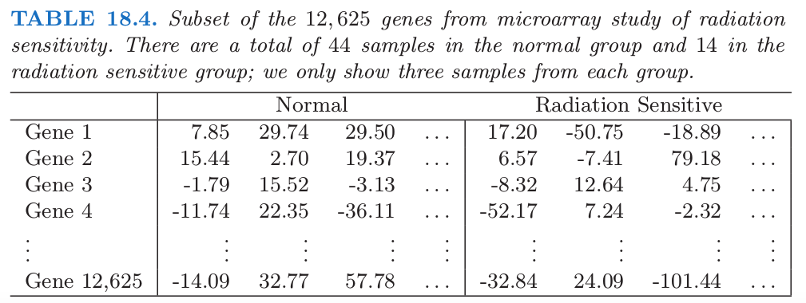
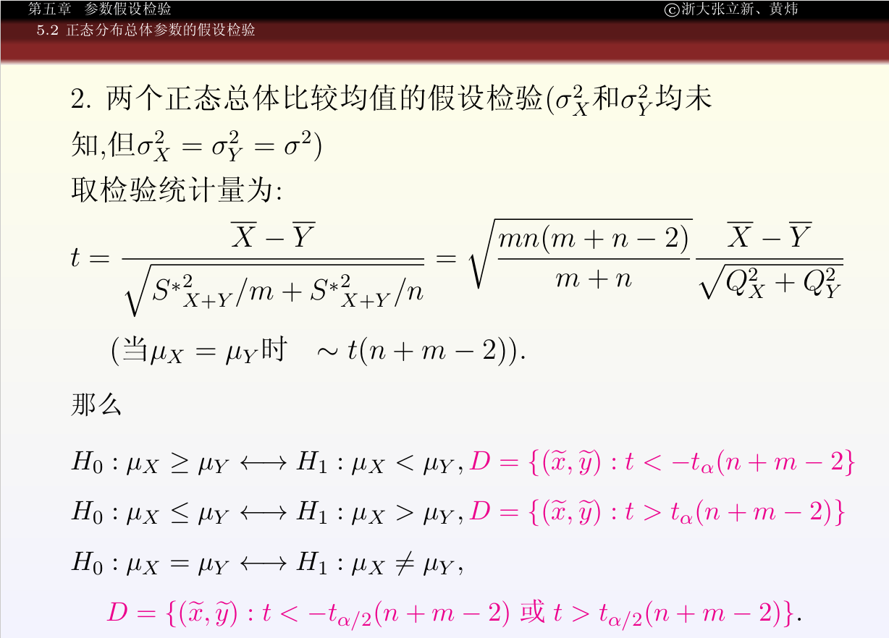
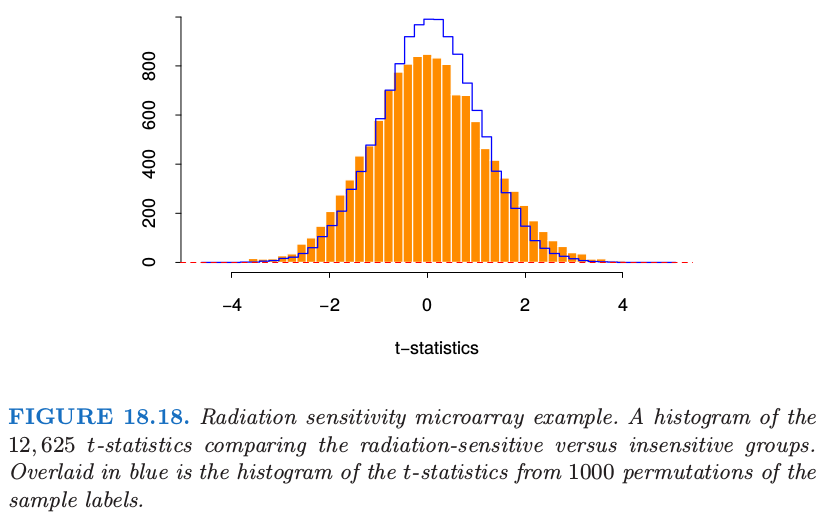
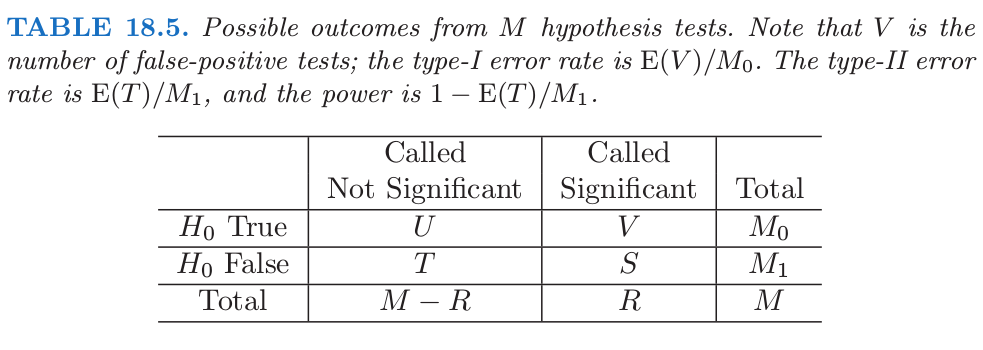
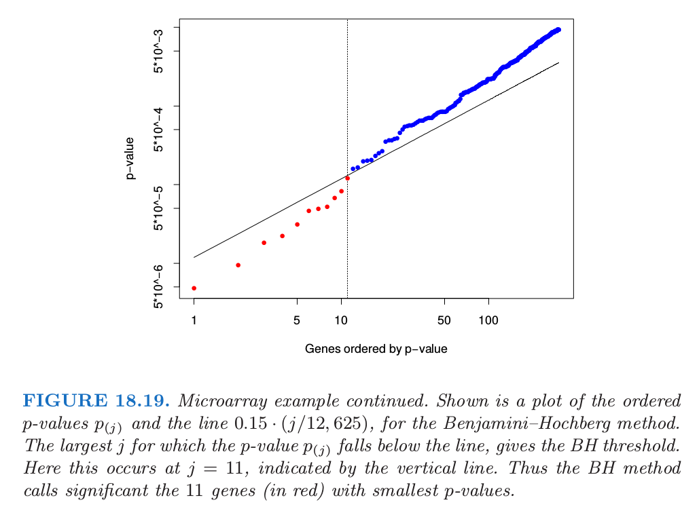
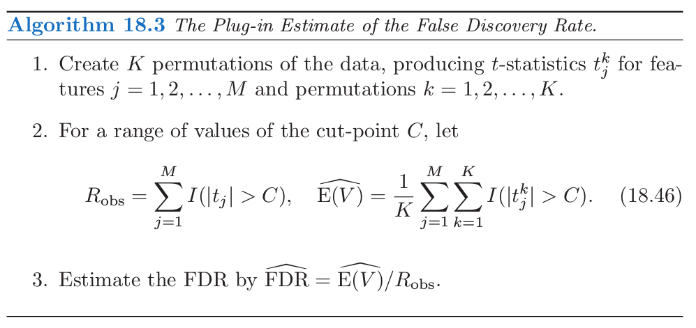
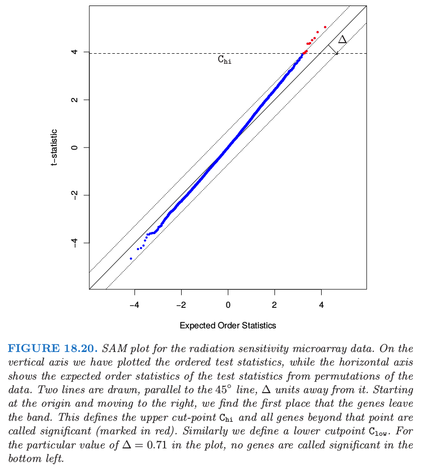

# 18.7 特征评估和多重检验问题

| 原文   | [The Elements of Statistical Learning](../book/The Elements of Statistical Learning.pdf) |
| ---- | ---------------------------------------- |
| 翻译   | szcf-weiya                               |
| 时间   | 2017-08-17:2017-08-19                    |
|更新|2017-12-29|

在本章的第一部分中我们讨论了$p>>N$情形下的预测模型。这里我们考虑在评估$p$个特征的显著性的这一基本问题。考虑18.4.1节中蛋白质质谱的例子。在这个问题中，研究者可能不关心对一个给定的病人作出预测，判断其是否有前列腺癌。而感兴趣的可能是识别出哪种蛋白质在正常群体和癌症群体中的含量有差异，由此加深对疾病的了解，并且对药物的研制有指导意义。因此我们的目标是评估单个特征的显著性。这个评估通常不用在本章中第一部分使用多变量预测模型来实现。特征评估问题将我们的关注点从预测移到传统的统计学话题——多重假设检验。在本章接下来的章节中，我们将用$M$来表示特征的个数，而不是$p$，因为我们将频繁用$p$表示$p$值。

举个例子，考虑表18.4的微阵列数据，数据取自一项研究癌症患者对电离辐射治疗的敏感性的研究（Rieger et al.，2004[^1]）。每一行包含58个病人样本的基因表达值：44个样本取自有正常反应的病人，而14个样本取自对电离辐射有严重反应的病人。测量值是在oligo-nucleotide微阵列上得到的。试验的目的是在对电离辐射敏感的病人群体中找出基因表达值不同的基因。总共有$M=12625$个基因，表中显示了部分基因和样本来解释。

为了识别出有用的基因，我们对每个基因构造两样本$t$统计量

$$
t_j = \frac{\bar x_{2j}-\bar x_{1j}}{se_j}\qquad (18.38)
$$

其中，$\bar x_{kj} = \sum_{i\in C_\ell}x_{ij}/N_\ell$。这里$C_\ell$是在群$\ell$中$N_\ell$个样本的指标集，其中$\ell = 1$表示正常的群体，而$\ell=2$表示敏感的群体。$se_j$是基因$j$的混合群内标准误差：

$$
se_j=\hat \sigma_j\sqrt{\frac{1}{N_1}+\frac{1}{N_2}}; \hat\sigma_j^2=\frac{1}{N_1+N_2-2}(\sum\limits_{i\in C_1}(x_{ij}-\bar x_{1j})^2+\sum\limits_{i\in C_2}(x_{ij}-\bar x_{2j})^2)
$$

!!! note "Recall"
    

图18.18的直方图用橘黄色显示了12625个t统计量，取值范围为-4.7到5.0。如果$t_j$服从正态分布，我们可以认为任何绝对值大于2的$t$统计量为显著的。这对应的显著水平为5%。这里有1189个基因的$\vert t_j\vert \ge 2$。然而，12625个基因中我们可能希望很多大的值是随机出现的，即使分组与任何基因都不相关。举个例子，如果基因是独立的（实际上它们当然不是），假阳性的基因个数会服从均值为$12625\cdot 0.05=631.3$，标准偏差为24.5的二项分布；实际的1189超出这个范围。

那我们怎么能够评估所有12625个基因的结果呢？这称为多重检验问题。我们可以像上面一样开始，计算每个基因的$p$值。当假设特征服从正态分布，这个可以使用理论上的$t$分布概率实现。一个吸引人的替代方案是使用排列分布，因为它避免了数据分布的假设。（理论上）我们计算样本的所有$K = \binom{58}{14}$种排列，并且对于每个排列$k$计算$t$统计量$t_j^k$。于是基因$j$的$p$值为

$$
p_j=\frac{1}{K}\sum\limits_{k=1}^KI(\vert t_j^k\vert > \vert t_j\vert)\qquad (18.40)
$$

当然，$\binom{58}{14}$是很大的数（大约$10^{13}$），因此我们不能列举出所有可能的排列。相反地，我们取可能的排列的一个随机样本，这里我们取一个$K=1000$种排列的随机样本。为了利用基因都是相似的这一事实（比如，在同一尺度下测量），我们可以将所有基因混合一起计算$p$值

$$
p_j=\frac{1}{MK}\sum\limits_{j'=1}^M\sum\limits_{k=1}^KI(\vert t_{j'}^k\vert>\vert t_j\vert)\qquad (18.41)
$$

这也给出了比(18.40)式更细致的$p$值，因为在混合零分布中比单一的零分布使用了更多的值。

采用这个$p$值的集合，我们要检验下面的假设

$$
H_{0j} = \text{治疗对基因}j\text{无作用}\\
H_{1j} = \text{治疗对基因}j\text{有作用}\\
\text{for } j=1,2,\ldots, M
$$

如果$p_j<\alpha$，我们在$\alpha$的水平下拒绝$H_{0j}$。这个检验的第一类错误等于$\alpha$，也就是，错误拒绝$H_{0j}$的概率为$\alpha$.

现在考虑更多的检验，我们应该采用什么作为误差的整体衡量不是很明显。令$A_j$为$H_{0j}$被错误拒绝的事件，由定义知$Pr(A_j)=\alpha$。FWER是至少存在一个被错误拒绝的概率，并且经常用它作为整体错误的衡量。具体地，如果$A=\cup_{j=1}^MA_j$是至少有一个被错误拒绝的概率，于是FWER为$Pr(A)$。一般地，对于较大的$M$，$Pr(A)>>\alpha$，并且取决于检验之间的相关性。如果检验之间互相独立，且第一类错误概率为$\alpha$，则FWER为$(1-(1-\alpha)^M)$。另一方面，如果检验之间有正依赖，即$Pr(A_j\mid A_k)>Pr(A_j)$，则FWER会小于$(1-(1-\alpha)^M)$。测试直接的正依赖在实际中经常发生，特别是基因研究中。

做多重检验的一个很简单的方式是Bonferroni方法。它让每个个体检验更加严格，使得FWER至多等于$\alpha$: 如果$p_j<\alpha/M$， 我们拒绝$H_{0j}$。可以很简单地证明这会使得FWER$\le\alpha$。Bonferroni方法在$M$相对较小的情形下有用，但是对于大的$M$则太过保守，也就是，得到的显著基因数目过少。

在我们的例子中，如果在$\alpha=0.05$水平下检验，则我们需要采用的阈值为$0.05/12625=3.9\times 10^{-6}$。在12625个基因的$p$值中没有比这还小。

有许多对该方法的变形，通过调整单个$p$值使得FWER至多为$\alpha$，一些方法避免了对独立性的假设，比如，Dudoit et al.（2002b）的工作。

## FDR

多重检验的另一种不同的方式不是试图控制FWER，但是关注假阳性基因的比例。正如我们将要看到的，这个方法在实际中有很强的吸引力。

图18.5总结了$M$个假设检验的理论结果。注意到FWER为$Pr(V\ge 1)$。

这里我们关注误发现率FDR

$$
FDR=E(V/R)\qquad (18.43)
$$

在微阵列中，这是被错误称为显著的基因占所有被称为显著的$R$个基因的比例的期望。这个期望从数据所产生的总体中取。Benjamini and Hochberg (1995)第一次提出误发现率的记号，并且给出了一个测试过程（算法18.2），该过程中FDR被用户所定义的层次$\alpha$所界定。Benjamini–Hochberg (BH)过程是基于$p$值；这些可以从检验估计量（如，高斯）的渐进近似得到，或者通过排列分布获得，这里采取排列分布。

如果假设是独立的，Benjamini and Hochberg (1995)证明了不管零假设对的个数以及当零假设为错的时候$p$值的分布，这个过程有如下性质

$$
FDR\le \frac{M_0}{M}\alpha\le \alpha\qquad (18.45)
$$

为了解释，我们取$\alpha=0.15$。图18.19展示了有序$p$值$p_{j}$，以及斜率为$0.15/12625$的直线。

从左边开始，并且向右移动，BH方法找到使得$p$值落在直线下方的最后一个点。这发生在$j=11$处，所以我们拒绝这11个有更小$p$值的假设。注意到第11小的$p$值的截断值为0.00012，且第11大的$\vert t_j\vert$ 为4.101。因此我们拒绝这11个$\vert t_j\vert\ge 4.101$的基因。

从我们简短的描述中，BH过程怎么进行的不是很清楚；也就是，为什么对应的FDR至多0.15（该例中的$\alpha$）。实际上，这一事实的证明相当复杂(Benjamini and Hochberg, 1995)

更直接的方式是plug-in方法。不是从某个$\alpha$的值开始，我们固定一个$t$统计量的截断点，如上面出现的4.101。等于或大于4.101的$\vert t_j\vert$观测值的个数为11。在总的排列数据中，大于等于4.101的$t_j^k$有1518个，对于每个排列平均为$1518/1000=1.518$。因此FDR的直接估计为$\widehat{FDR}=1.518/11\sim 14\%$。注意到14%近似等于上面使用的$\alpha=0.15$（差异由于离散化)。这个过程在算法18.3中有描述。概述如下：

> 算法18.3FDR的plug-in估计等价于采用(18.40)$p$值的排列的算法18.2的BH过程。

BH方法和plug-in估计之间的对应不是巧合。练习18.17证明一般情形它们是等价的。注意到这个过程不需要引用$p$值，而是直接处理检验统计量。

plug-in估计基于下列的近似

$$
E(V/R)\approx\frac{E(V)}{E(R)}\qquad (18.47)
$$

而且一般地，$\widehat{FDR}$是FDR的一致估计（Storey, 2002; Storey et al., 2004）。注意到分子$\widehat{E(V)}$实际上估计了$(M/M_0)E(V)$，因为排列分布使用$M$而非$M_0$个零假设。因此如果有了$M_0$的一个估计，FDR的一个良好估计FDR的良好估计可以从$(\hat M_0/M)\cdot \widehat{FDR}$中得到。练习18.19展示了估计$M_0$的一种方式。最保守的FDR估计方法是用$M_0=M$（向上偏）。等价地，$M_0$的估计可以用来改善BH方法，通过关系(18.45)。

读者可能会惊讶我们选了一个较大的数0.15作为FDR的界$\alpha$。我们必须记住FDR不同于第一类误差，后者经常选择0.05。对于科学家，FDR是假阳性在被统计学家称为显著的基因中比例的期望。微阵列实验表明FDR达到0.15仍然有用，特别是当我们探索自然时。

## 对称分割点和SAM过程

在上面描述的检验方法中，我们采用检验统计量$t_j$的绝对值，因此对于统计量的正值和赋值有相同的截断点。在一些试验中，可能会出现大部分或者所以的差异表达基因在正方向上变化（或者所有都在负方向）。对于这种情形，对两种情形分布导出截断点是有利的。

微阵列的显著性分析(SAM)提供了一种方式。SAM方法的基本思想展现在图18.20中。在竖轴上，我们画出有序测试统计量$t_{(1)}\le t_{(2)}\le \ldots t_{(M)}$，而横轴展示了从数据的排列中得到的有序统计量的期望：$\tilde t_{(j)}=(1/K)\sum_{k=1}^Kt_{(j)}^k$，其中$t_{(1)}^k\le t_{(2)}^k\le \cdots\le t_{(M)}^k$是排列$k$的有序检验统计量。

图中作出了平行于角平分线，间距为$\Delta$的两条横线。从原点开始向右移动，寻找离开该带的第一个点。这定义了上截断点$C_{hi}$，并且所有高出该点的基因称为显著（标记为红色）。类似地，在左下角寻找下截断点$C_{low}$。因此每个调整参数$\Delta$定义了上下截断点，对于每个截断点，$\widehat{FDR}$的plug-in估计和前面一样。一般地，计算一系列的$\Delta$和与之相关的$\widehat{FDR}$，主观上从中选择一组值。

SAM的优势在于截断点的可能的不对称性。在图18.20的例子中，当$\Delta=0.71$，我们得到11个显著基因；它们都位于右上方。位于左下方的数据点从未离开带状区域，也因此有$C_{low}=-\infty$。因此，对于该$\Delta$，在左（负）侧没有被称为显著的基因。我们不会如18.7.1节中一样在这些截断点上加上对称性，因为这里没有理由假设在两端有相似的行为。

似然比检验中，这个方法和非对称方法之间存在联系。假设我们在无影响的零假设下有对数似然$\ell_0(t_j)$，并且在备择假设下有对数似然$\ell(t_j)$。则似然比检验意味着如果对于某些$\Delta$，

$$
\ell(t_j)-\ell_0(t_j)>\Delta \qquad (18.48)
$$

则拒绝零假设。

取决于这些似然，特别是相对值，这可以对于$t_j$的阈值不同于$-t_j$的阈值。当

$$
\vert t_{(j)}-\tilde t_{(j)}\vert >\Delta\qquad (18.49)
$$

再次，每个$t_{(j)}$的阈值取决于对应的$\tilde t_{(j)}$值。

## FDR的贝叶斯解释
