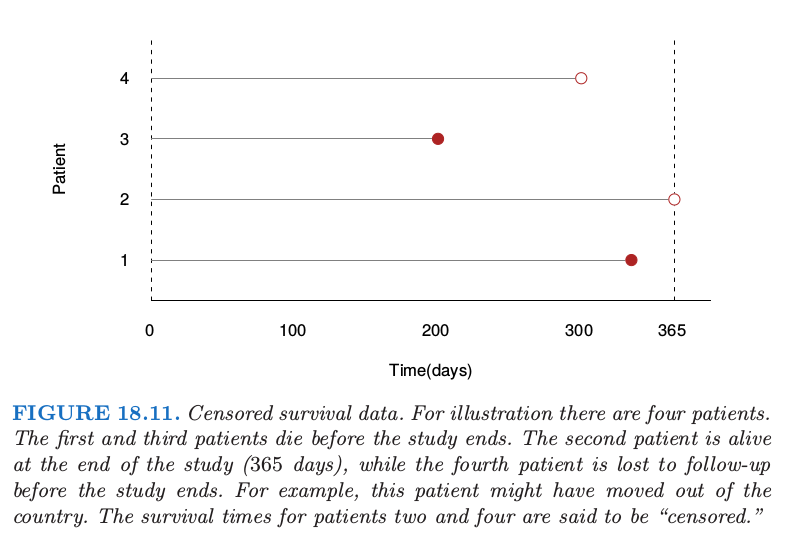
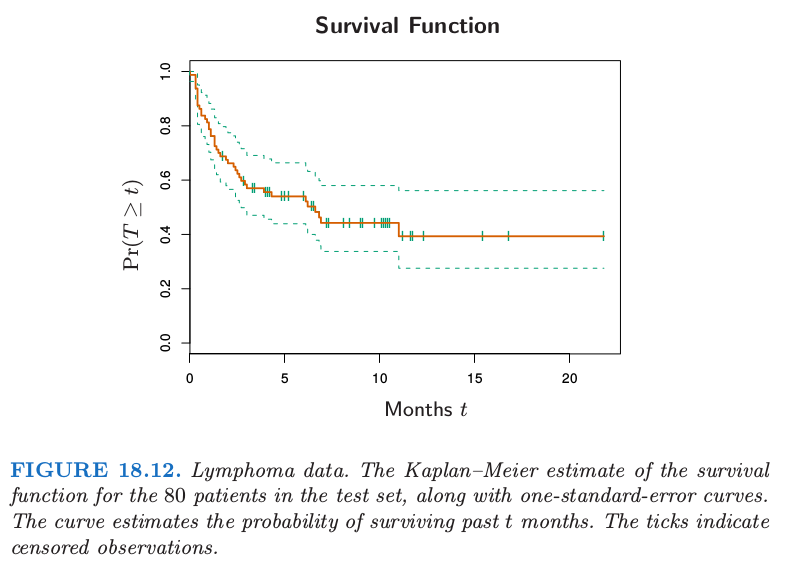
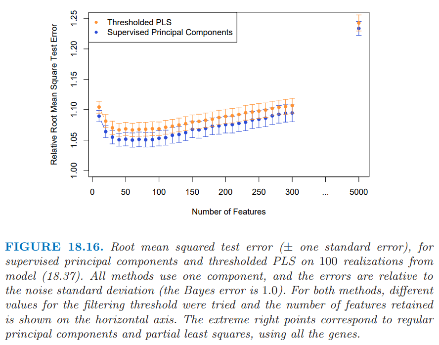
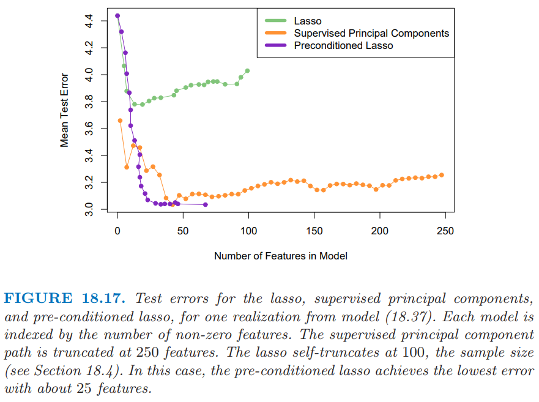

# 18.6 高维回归: 有监督的主成分

| 原文   | [The Elements of Statistical Learning](../book/The Elements of Statistical Learning.pdf) |
| ---- | ---------------------------------------- |
| 翻译   | szcf-weiya                               |
| 时间   | 2017-08-17                    |
| 更新   | 2018-02-04, 2018-03-07, 2018-03-08                    |
|状态   |In Progress   |

这一节中我们将要描述一种在$p >> N$情形下特别有用的回归和广义回归的简单方法。 我们用另外一个微阵列数据的例子来解释这一方法。 数据取自 Rosenwald et al. (2002)[^1]，其中包含240个患有DLBCL的病人，有7399个基因表达水平的测量值。输出变量为生存时间，取值为“observed”或者“right censored”。我们将样本随机分成大小为160的训练集和大小为80的测试集。

尽管有监督的主成分对线性回归很有用，但是它最有趣的应用也许是在生存分析中，这也是这个例子所要关注的地方。

<!--
!!! note "censored survival data"
    个人理解是, 数据中无对应的记录值, 也就是只有部分个体有*生存时间*的记录值, 而其他个体没有记录值.[NEED VERIFIED!!]

-->

我们还没有在这本书中讨论censored survival数据的回归问题；它表示了回归的一般形式，输出变量（生存时间）只对一部分个体有观测。举个例子我们实施一项持续365天的医学研究， 为了简便起见， 所有的项目在一天完成。 我们可能会观测到研究开始后有个体200天后就死亡，但也有个体研究结束后还活着。这个个体则称为365天“right censored”。我们仅仅知道他/她至少活了365天。 尽管我们并不知道过了多久该个体会死去, 但“censored”观察值仍然很有意义。 图18.11诠释了这一意义。图18.12显示了对测试集中的80个病人应用Kaplan–Meier方法估计得到的生存曲线。关于Kaplan–Meier方法的描述可以参见Kalbfleisch and Prentice(1980)[^2]中的例子。

在这个例子中我们的目标是寻找可以预测一组独立病人个体的生存时间的特征（基因）集合。这个可以作为一个**预后**指示变量来帮助选择治疗方案, 或者帮助理解这个疾病的生理基础.

!!! note "预后(prognostic)"
    预后是指预测疾病的可能病程和结局。它既包括判断疾病的特定后果（如康复，某种症状、体征和并发症等其它异常的出现或消失及死亡）；也包括提供时间线索，如预测某段时间内发生某种结局的可能性。由于预后是一种可能性，主要指病人群体而不是个人。从疾病演进过程的角度划分，预后的量度有缓解率、复发率、病残率等；从疾病终极状态的角度划分，预后的量度有治愈率、生存率、病死率等。 (refer to www.bing.com)

有监督的主成分的潜在概念模型如图18.13所示。

我们想象存在两种类型的细胞，拥有好细胞的病人平均会活得久一些。然而, 两者之间存在相当大部分的重叠。我们可能将存活时间作为细胞类型的有噪声的代理变量("noisy surrogate")。全监督方法会赋予那些与生存越有关的基因更多的权重。这些基因与细胞类型部分相关（但不是完全）。换种方式，如果我们能够发现病人潜在的细胞类型，它经常受到通路中相当多的基因一起作用的影响，或许在预测病人的生存方面会取得更好的结果。

尽管图18.13中的细胞类型是离散的，但想象其为连续的是有帮助的，将它定义为特征的某些线性组合。我们将会把细胞类型作为连续值来估计，接着为了展示和解释的需要进行离散化。

我们应该怎样寻找这个定义了潜在细胞类型的线性组合呢? [第14.5节](../14-Unsupervised-Learning/14.5-Principal-Components-Curves-and-Surfaces/index.html)的主成分分析是一个用来发现数据集中表现出大方差的特征的线性组合。但是我们这里需要寻找的是高方差**以及**与响应变量有显著相关性的线性组合。图18.14的右下图显示了在这个例子中应用标准的主成分的结果；第一主成分与生存时间的相关性并不是很高。

因此我们想要主成分分析寻找到与输出有高相关的特征的线性组合。为了实现这一点，我们限制在那些本身就与输出变量存在高相关性的变量上。这已经总结在了算法18.1中，并且在图18.14中做了解释.

算法中第(1)和第(2b)步的细节取决于输出变量的类型。对于标准的回归问题，我们在步骤(1)中采用单变量的线性最小二乘系数，在第(2b)步采用线性的最小二乘模型。对于生存分析问题, 广泛使用**Cox的比例风险回归(Cox's proportional hazards regression)**；因此这里在第(1)步，我们采用得分检验，在第(2b)步中采用多变量Cox模型。具体细节对于理解这一基本方法不重要；它们可以在Bair et al. (2006)[^5]中找到。

!!! note "Cox Regression (proportional hazards regression)"
    可以参见本人的英文博客，其中有对cox回归的介绍以及在R语言中利用cox回归研究实际中的survival analysis。

图18.14展示了这个例子中有监督的主成分的结果。我们采用3.53作为Cox得分的分割点，得到了27个基因，其中3.53是通过10折交叉验证得到的。接着我们仅利用这27个基因的训练集以及其所对应的测试集中的观测值来计算第一主成分$(m=1)$。我们将这些作为Cox回归模型的定量变量，其似然比的显著程度为$p=0.005$。当进行二值化（采用训练数据集的均值作为阈值），它能够清晰地将测试集中的病人划分成了低风险和高风险的群体 (图18.14中右边中间的图, $p=0.006$)。

图18.14中右边最上面的图仅仅采用最高得分的基因作为生存的预测变量。在测试集上不显著。同样地，右边最下面的图显示了采用所有训练数据的主成分的二值化，这也是不显著的。

我们的过程允许在第(2a)步中采用$m > 1$个主成分。然而，步骤(1)中的有监督使得主成分与输出变量一致，也因此在大部分情形下，只有第一或者前几个主成分对预测有用。在下面的数学部分，我们仅仅考虑第一主成分，但是推广到多余一个主成分可以按照类似的方式进行。

## 与潜变量模型的联系

监督主成分和潜在细胞类型之间的联系可疑通过数据的潜变量来体现。假设我们有响应变量$Y$。它通过线性模型与潜变量$U$关联起来

$$
Y=\beta_0+\beta_1U+\varepsilon\qquad (18.32)
$$

另外，我们有由$j\in\cal P$索引的特征$X_j$的结合中测量值，其中

$$
X_j=\alpha_{0j}+\alpha_{1j}U+\epsilon_j\;j\in \cal P\qquad (18.33)
$$

误差$\varepsilon$和$\epsilon_j$假设均值为零且在各自模型中与其它随机变量独立。

我们也有许多额外的特征$X_k, k\in \cal P$是独立于$U$的。我们想要识别$\cal P$，估计$U$，因此拟合预测模型(18.32)。这是潜变量结构模型的特殊情形，或者说是单组分因子分析模型（(Mardia et al., 1979[^1]，也参见[第14.7节](../14%20Unsupervised%20Learning/14.7%20Independent%20Component%20Analysis%20and%20Exploratory%20Projection%20Pursuit/index.html)）潜变量$U$是图18.13中概念化的细胞类型的连续版本。

监督主成分算法可以看成是拟合这个模型的方法：

1. 第(1)步筛查估计集合$\cal P$。
2. 给定$\cal P$，第2(a)步中最大的主成分估计潜变量$U$。
3. 最后，第2(b)中的回归拟合估计模型(18.32)中的系数。

第(1)步是自然的，因为平均而言，只有当$\alpha_{1j}$不为零时，回归系数才是非零的。因此这步应该会选出特征$j\in\cal P$。如果我们假设误差$\epsilon_j$有高斯分布且有相同的方差，则第(2a)步也是自然的。这种情形下主成分是单因子模型的极大似然估计(Mardia et al., 1979[^3])。第(2b)中的回归是很显然的。

假设总共有$p$个特征，其中$p_1$个特征在相关集合$\cal P$中。则如果$p$和$p_1$都增长但$p_1$比$p$相对较小，可以证明（在合理的条件下）第一主成分对于潜因子是一致的。通常情形下的主成分可能不是一致的，因为它可能被大量的噪声特征所污染。

最后，假设在监督主成分过程中的第(1)步使用的阈值产生大量的特征用于计算主成分。则为了解释性，也同样为了实际应用，我们会寻找降维后的子集特征来近似模型。预处理(Pre-conditioning)是其中的一种方式。

## 与偏最小二乘的联系
TODO

....

用一个模拟例子来数值比较这些方法。例子中有$N=100$个样本，$p=5000$个基因。按如下方式生成数据：

其中$\epsilon_{ij}$和$\varepsilon_i$是均值为0标准差分别为1和1.5的独立正态随机变量。

....

## 特征选择的预处理

正如图18.16展示的，监督主成分可以得到比其它方法更低的测试误差。

然而，并不总是得到只涉及一小部分特征（基因）的稀疏模型。即使算法中的步骤(1)的阈值得到相对较少的特征，但可能部分被忽略的特征与监督主成分直接有不可忽略的内积（并且可以看成是较好的代表(surrogate)）。另外，高相关的特征会趋向于一起选，则在已经选择的特征中会造成较大程度的冗余。

另一方面，lasso（18.4节和3.4.2节）从数据中得到稀疏的模型。应用到上一节中的模拟例子，这两个方法的测试误差会如何呢？图18.17显示了对于模型(18.37)，lasso、监督主成分和预处理lasso（下面描述）的测试误差。

我们看到监督主成分（橘黄色曲线）当大概50个特征包含进模型中会达到最低误差，这个数字也是模拟例子中真实的个数。尽管关于前50个特征的线性模型是最优的，但是lasso（绿色）被大量噪声特征所严重影响，而且starts overfitting when far fewer are in the model.

!!! question
    如何理解“starts overfitting when far fewer are in the model.”

我们能否得到监督主成分的低测试误差以及lasso的稀疏性？这是预处理(pre-conditioning)的目标(Paul et al., 2008[^4])。在这种方法中，首先计算训练集中的每个观测的监督主成分的预测量$\hat y_i$（其中阈值通过交叉验证来选择）。接着我们将lasso应用到$\hat y_i$，其中$\hat y_i$被看成输出变量，它替换了通常情形下的$y_i$。这个想法是首先对输出变量进行去噪(denoising)，则lasso不会被大量噪声特征所影响。图18.17显示了预处理（紫色曲线）在这里取得了重要成功，比通常的lasso的测试误差要低很多，在这种情形下与监督主成分一样第。而且采用更少的特征便达到了最小测试误差。应用到原始输出变量的一般lasso比预处理lasso更快地过拟合。预处理lasso的过拟合不是问题，因为输出变量已经去噪了。对于预处理的lasso，我们经常用更主管的理由来选择调整参数，比如简约性(parsimony)。

预处理可以应用到不同的设定中，采用除监督主成分外的初始估计和除lasso以外的后续估计。更多细节可以在Paul et al. (2008)[^2]中找到。

[^1]: Rosenwald, A., Wright, G., Chan, W. C., Connors, J. M., Campo, E., Fisher, R. I., Gascoyne, R. D., Muller-Hermelink, H. K., Smeland, E. B. and Staudt, L. M. (2002).  The use of molecular profiling to predict survival after chemotherapy for diffuse large b-cell lymphoma, The New England Journal of Medicine 346: 1937–1947
[^2]: Kalbfleisch, J. and Prentice, R. (1980). The Statistical Analysis of Failure Time Data, Wiley, New York.
[^3]: Mardia, K., Kent, J. and Bibby, J. (1979). Multivariate Analysis, Academic Press.
[^4]: Paul, D., Bair, E., Hastie, T. and Tibshirani, R. (2008). “Pre-conditioning” for feature selection and regression in high-dimensional problems, Annals of Statistics 36(4): 1595–1618.
[^5]: Bair, E., Hastie, T., Paul, D. and Tibshirani, R. (2006). Prediction by supervised principal components, Journal of the American Statistical Association 101: 119–137.