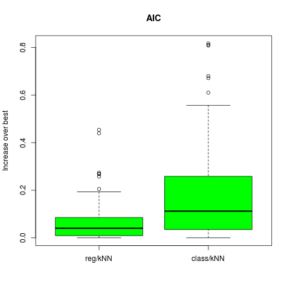
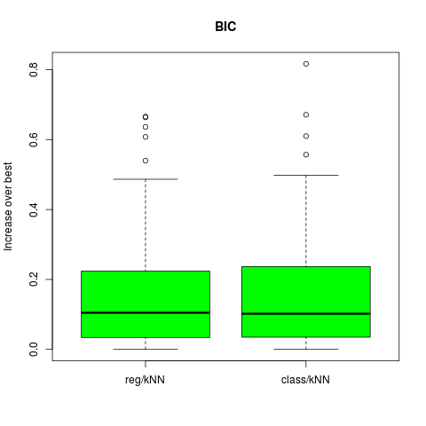

# 模拟：Fig. 7.7

| R Notebook   | [模拟：Fig. 7.7](http://rmd.hohoweiya.xyz/sim7_7.html) |
| ---- | ---------------------------------------- |
| 作者   | szcf-weiya                               |
| 时间   | 2018-01-05                               |
| 更新 | 2018-02-04 |

本笔记是[ESL7.9节](https://esl.hohoweiya.xyz/07%20Model%20Assessment%20and%20Selection/7.9%20Vapnik-Chervonenkis%20Dimension/index.html)图7.9的模拟。

目前完成了AIC和BIC下kNN的回归与分类，剩余情形以后再补上。

## 问题回顾

这是接着图7.3的例子的后续。

采用AIC，BIC和SRM来对图7.3的例子来选择模型大小。对于KNN，模型指标$\alpha$指的是邻居的个数，而对于标着REG的来说$\alpha$为子集大小。采用每个选择方法（例如，AIC），我们估计最优模型$\hat \alpha$并且在测试集上找到真实的预测误差$Err_{\cal T}(\hat\alpha)$。对于同样的训练集，我们计算最优和最坏可能的模型选择的预测误差：$min_\alpha Err_{\cal T}(\alpha)$和$max_\alpha Err_{\cal T}(\alpha)$。
考察下列比值，它表示采用选择的模型和最优模型的误差
$$
100\times \frac{Err_{\cal T}(\hat \alpha)-min_\alpha Err_{\cal T}(\alpha)}{max_\alpha Err_{\cal T}(\alpha)-min_\alpha Err_{\cal T}(\alpha)}
$$
并作出箱线图。

## 几个问题

1. 估计$\sigma_\epsilon^2$

原书中提到
$$
[N/(N-d)]\cdot \overline{err}
$$

2. k最近邻的有效参数个数

原书有介绍：$N/k$。

3. $k=1$如何求训练误差
因为$k=1$得到0训练误差，故最小$k$取5。

## 生成数据

```R
# generate dataset
genX <- function(n = 80, p = 20){
  X = matrix(runif(n*p, 0, 1), ncol = p, nrow = n)
  return(X)
}
# generate response
genY <- function(X, case = 1){
  n = nrow(X)
  Y = numeric(n)
  if (case == 1){ # for the left panel of fig. 7.3
    Y = sapply(X[, 1], function(x) ifelse(x <= 0.5, 0, 1))
  }
  else {
    Y = apply(X[, 1:10], 1, function(x) ifelse(sum(x) > 5, 1, 0))
  }
  return(Y)
}

## global parameters setting
ntest = 10000
B = 100 # the number of repetition

## generate test data
X.test = genX(n = ntest)
Y.test = genY(X.test)
```

## AIC/BIC情形下的kNN分类和回归

```R
library(caret)
# for regression
err.aic = numeric(B)
err.bic = numeric(B)
# for classification
err.cl.aic = numeric(B)
err.cl.bic = numeric(B)
N = 80
for (i in 1:B)
{
  X = genX(n = N)
  Y = genY(X)
  # vary the number of neighbor
  epe = numeric(46)
  epe.cl = numeric(46)
  aic = numeric(46) # pay attention!! the effective number is N/k
  bic = numeric(46)
  aic.cl = numeric(46)
  bic.cl = numeric(46)
  for (k in 5:50)
  {
    model = knnreg(X, Y, k = k)
    pred = predict(model, X.test)
    # for classification
    pred.cl = sapply(pred, function(x) ifelse(x > 0.5, 1, 0))
    epe[k-4] = mean((pred - Y.test)^2)
    epe.cl[k-4] = mean(pred.cl!=Y.test)
    # the training error
    yhat = predict(model, X)
    yhat.cl = sapply(yhat, function(x) ifelse(x > 0.5, 1, 0))
    err = yhat - Y
    err.cl = (yhat.cl != Y)
    aic[k-4] = mean(err^2)*(1 + 2/k * (N/(N-N/k)) )
    bic[k-4] = mean(err^2)*(1 + log(nrow(X))/k * (N/(N-N/k)) )
    aic.cl[k-4] = mean(err.cl)*(1 + 2/k * (N/(N-N/k)) )
    bic.cl[k-4] = mean(err.cl)*(1 + log(N)/k * (N/(N-N/k)) )
  }
  err.aic[i] = (epe[which.min(aic)] - min(epe)) / (max(epe) - min(epe))
  err.bic[i] = (epe[which.min(bic)] - min(epe)) / (max(epe) - min(epe))
  err.cl.aic[i] = (epe.cl[which.min(aic.cl)] - min(epe.cl)) / (max(epe.cl) - min(epe.cl))
  err.cl.bic[i] = (epe.cl[which.min(bic.cl)] - min(epe.cl)) / (max(epe.cl) - min(epe.cl))
}
```
作图
```R
## AIC plot
#png("boxplot-AIC-kNN.png")
df.aic = data.frame(val = c(err.aic, err.cl.aic),
                    case = factor(c(rep("reg/kNN", B), rep("class/kNN", B)),
                                  levels = c("reg/kNN", "class/kNN")) )
boxplot(val ~ case, data = df.aic, col = "green",
        main = "AIC", ylab = "Increase over best")
#dev.off()

## BIC plot
#png("boxplot-BIC-kNN.png")
df.bic = data.frame(val = c(err.bic, err.cl.bic),
                    case = factor(c(rep("reg/kNN", B), rep("class/kNN", B)),
                                  levels = c("reg/kNN", "class/kNN")) )
boxplot(val ~ case, data = df.bic, col = "green",
#dev.off()
```






## 其它情形

待完成......
