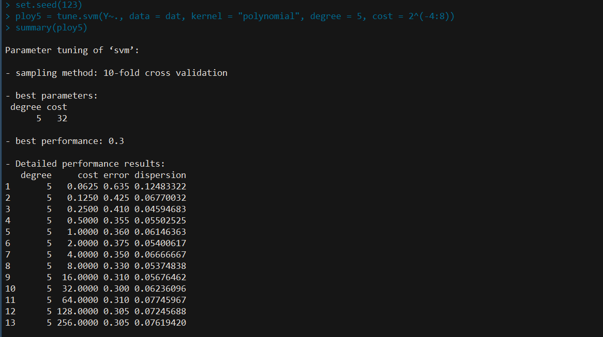
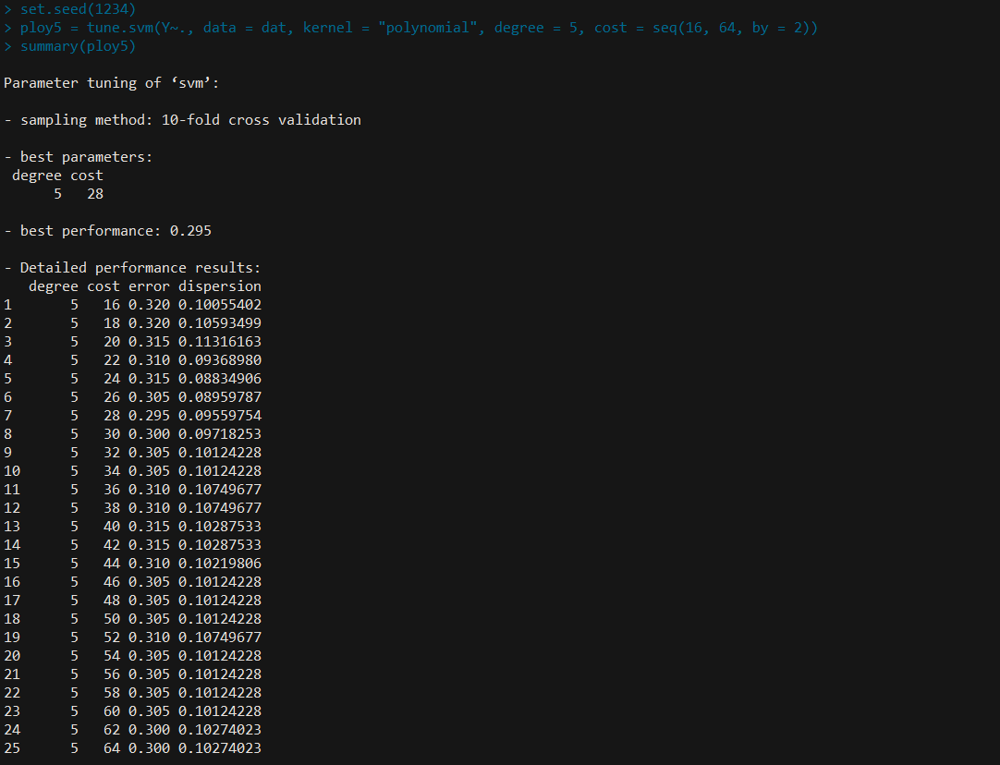
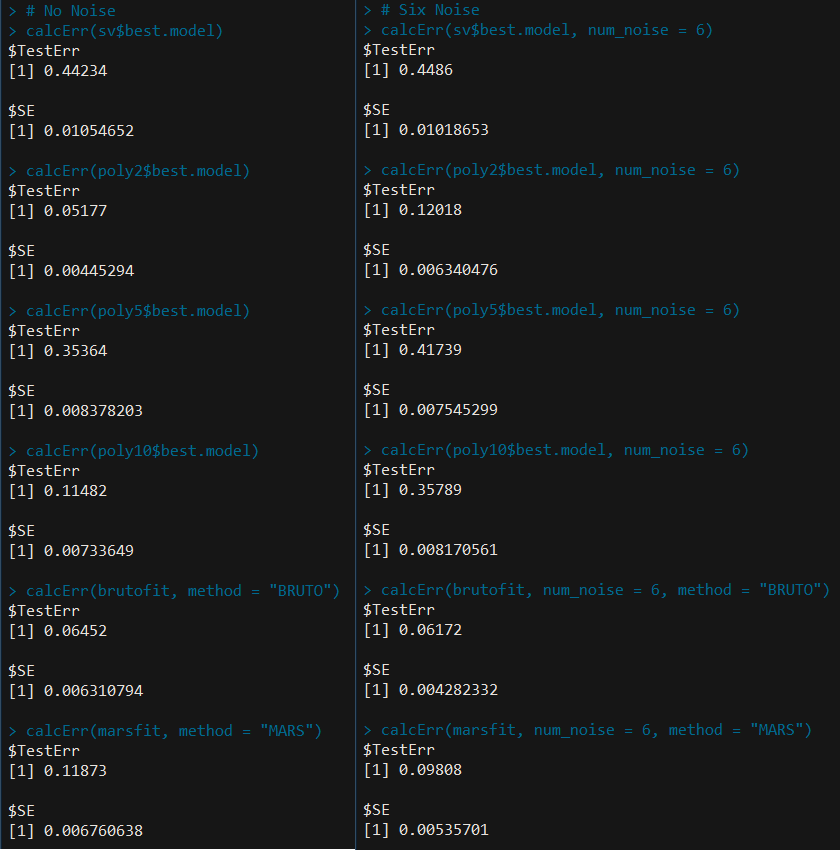

# 模拟：Tab. 12.2

|  原文  | [12.3 支持向量机和核](../../12-Support-Vector-Machines-and-Flexible-Discriminants/12.3-Support-Vector-Machines-and-Kernels/index.html) |
| ---- | ---------------------------------------- |
| 作者   | szcf-weiya                               |
| 时间   | 2018-03-02                               |

## 背景重述

在两个类别中产生100个观测值。第一类有4个标准正态独立特征$X_1,X_2,X_3,X_4$。第二类也有四个标准正态独立特征，但是条件为$9\le \sum X_j^2\le 16$。这是个相对简单的问题。同时考虑第二个更难的问题，用6个标准高斯噪声特征作为增广特征。

## 生成数据

```r
## #####################################
## generate dataset
## 
## `No Noise Features`: num_noise = 0
## `Six Noise Features`: num_noise = 6
## #####################################
genXY <- function(n = 100, num_noise = 0)
{
  ## class 1
  m1 = matrix(rnorm(n*(4+num_noise)), ncol = 4 + num_noise)
  ## class 2
  m2 = matrix(nrow = n, ncol = 4 + num_noise)
  for (i in 1:n) {
    while (TRUE) {
      m2[i, ] = rnorm(4 + num_noise)
      tmp = sum(m2[i, 1:4]^2)
      if(tmp >= 9 & tmp <= 16)
        break
    }
  }
  X = rbind(m1, m2)
  Y = rep(c(1, 2), each = n)
  return(data.frame(X = X, Y = as.factor(Y)))
}
```

## 模型训练

1. SVM直接调用`e1071`包中的`svm`函数
2. BRUTO和MARS都是调用`mda`包，且由于两者都是用于回归，所以转换为分类时，是比较拟合值与类别标签的距离，划分到越靠近的那一类
3. 原书中提到实验中MARS不限定阶数，但实际编程时，设置阶数为10

## 交叉验证选择合适的$C$

我分两步进行选择：

1. 粗选：在较大范围内寻找最优的$C$
2. 细分：在上一步选取的最优值附近进行细分

注意避免最优值取在边界值。以SVM/poly5为例进行说明，其他类似

```r
## SVM/poly5
set.seed(123)
poly5 = tune.svm(Y~., data = dat, kernel = "polynomial", degree = 5, cost = 2^(-4:8))
summary(poly5)
```



此时选取的最优$C$为32，进一步细化

```r
set.seed(1234)
poly5 = tune.svm(Y~., data = dat, kernel = "polynomial", degree = 5, cost = seq(16, 64, by = 2))
summary(poly5)
```



所以$C$取28。

类似地，得到其它方法的最优$C$，比如某次实验结果如下：

|Method|best cost|
|---|---|
|SV Classifier|2.6 |  
|SVM/poly 2| 1|
|SVM/poly 5| 28|
|SVM/poly 10| 0.5|

!!! tip
    当然，实际中我们并不需要重新设置参数来训练模型，因为`tune.svm()`的返回结果就包含了最优模型，直接调用，比如`poly5$best.model`


## 计算测试误差

```r
predict.mars2 <- function(model, newdata)
{
  pred = predict(model, newdata)
  ifelse(pred < 1.5, 1, 2)
}

calcErr <- function(model, n = 1000, nrep = 50, num_noise = 0, method = "SVM")
{
  err = sapply(1:nrep, function(i){
    dat = genXY(n, num_noise = num_noise)
    datX = dat[, -ncol(dat)]
    datY = dat[, ncol(dat)]
    if (method == "SVM")
      pred = predict(model, newdata = datX)
    else if (method == "MARS")
      pred = predict.mars2(model, newdata = datX)
    else if (method == "BRUTO")
      pred = predict.mars2(model, newdata = as.matrix(datX))
    sum(pred != datY)/(2*n) # Attention!! The total number of observations is 2n, not n
  })
  return(list(TestErr = mean(err),
              SE = sd(err)))
}
```

值得说明的是，对于BRUTO和MARS，因为程序是将其视为回归模型处理的，需要进一步转换为类别标签。因为程序中类别用1和2编号，所以判断拟合值是否大于1.5，大于则划为第二类，否则第一类。

## 结果



将之与表12.2进行比较，可以看出各个方法的误差率及标准差的相对大小都比较一致。

## 贝叶斯误差率

对于类别1，
$$
\sum X_j^2\sim \chi^2(4)
$$
对于类别2，
$$
\sum X_j^2\sim \frac{\chi^2(4)I(9\le\chi^2(4)\le 16)}{\int_9^{16} f(t)dt}
$$
其中$f(t)$是$\chi^2(4)$的密度函数。

于是贝叶斯误差率为

$$
\frac{1}{2}\int_{9}^{16}f(t)dt\approx 0.029
$$

!!! note "weiya注：计算贝叶斯误差率"
    可以参考[probability - Calculating the error of Bayes classifier analytically - Cross Validated](https://stats.stackexchange.com/questions/4949/calculating-the-error-of-bayes-classifier-analytically)

!!! tip
    完整代码可以参见[skin-of-the-orange.R](https://github.com/szcf-weiya/ESL-CN/blob/master/docs/notes/SVM/skin-of-the-orange.R)