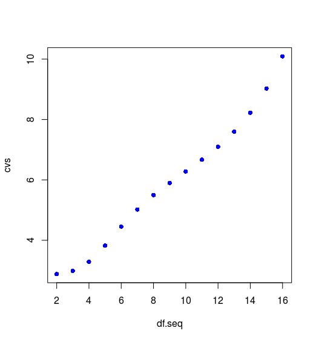
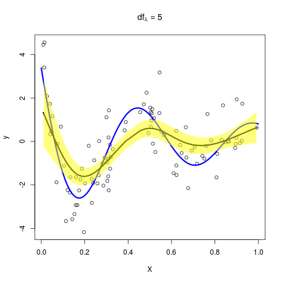
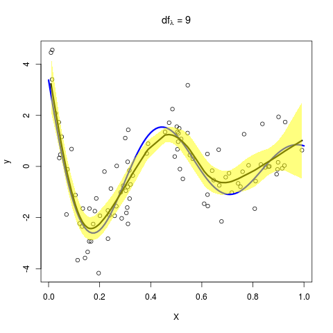
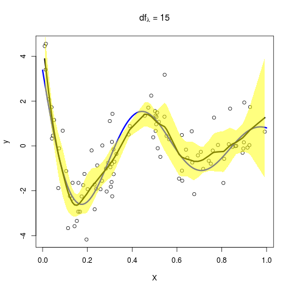

# 模拟：Fig. 5.9

| 原文   | [5.5 光滑参数的自动选择](../../05-Basis-Expansions-and-Regularization/5.5-Automatic-Selection-of-the-Smoothing-Parameters/index.html) |
| ---- | ---------------------------------------- |
| 作者   | szcf-weiya                               |
| 时间   | 2018-03-30                               |

## 生成数据

模型为

$$
\begin{align}
Y& =f(X)+\varepsilon\\
f(X)&=\frac{\sin(12(X+0.2))}{X+0.2}
\end{align}
\qquad (5.22)
$$

其中 $X\sim U[0,1], \varepsilon\sim N(0, 1)$。

```r
## generate dataset
func <- function(x)
{
  return(sin(12*(x+0.2))/(x+0.2))
}
genXY <- function(N = 100)
{
  x = runif(N)
  noise = rnorm(N)
  y = func(x) + noise
  return(list(X = x,
              Y = y))
}
```

## 计算 CV

### 错误的做法

在 `R` 中，可以用`smooth.spline()` 来拟合三次光滑样条。一开始，注意到该函数返回值有 `LOOCV` （或 `GCV`），于是觉得只用一个循环就可以得到交叉验证随自由度变化的曲线（原图中的交叉验证便是舍一法），即

```r
nrep = 15
df.seq = (1:nrep)+1
models = vector("list", nrep)
cvs = numeric(nrep)
for (i in 1:nrep){
    models[[i]] = smooth.spline(X, Y, df = df.seq[i], cv=TRUE, all.knots = TRUE)
    cvs[i] = models[[i]]$cv.crit
}
```

但这样得到的图象为



这与图 5.9 的图象完全不一样，曲线走势还是相反的，所以这样理解是有问题的。详细阅读帮助文档，我的结论是，虽然我们指定了有效自由度 $\df_\lambda$，但模型参数中的交叉验证还是用来进行模型选择，因为还有一个参数 `spar` 可以调整样条的光滑度，这一点书上似乎没有提到。所以便根据定义自己编写适用的计算 CV 的函数

### 自定义函数

直接根据舍一法交叉验证公式进行计算

$$
\CV(\hat f_\lambda) =\frac 1N\sum\limits_{i=1}^N(y_i-\hat f_\lambda^{(-i)}(x_i))^2\qquad (5.26)
$$

```r
mysmooth.spline <- function(X, Y, df){
  nY = length(Y)
  nX = length(X)
  cv.i = as.numeric(nX)
  if (nX != nY)
    return(0)
  # calculate LOOCV
  for (i in 1:nX){
    x = X[-i]
    y = Y[-i]
    model = smooth.spline(x, y, df = df, all.knots = TRUE)
    cv.i[i] = (Y[i] - predict(model, X[i])$y)^2
  }
  cv = mean(cv.i)
  # calculate EPE
  # ...
}
```

## 计算 CV

定义式为

$$
\begin{align}
\EPE(\hat f_\lambda) &=\E(Y-\hat f_\lambda(X))^2\\
&= \Var(Y)+\E[\Bias^2(\hat f_\lambda(X))+\Var(\hat f_\lambda(X))]\\
&= \sigma^2+\MSE(\hat f_\lambda)\qquad (5.25)
\end{align}
$$

问题是怎么求期望呢？

### 第一次尝试

第一次尝试是与上述计算 CV 时的错误做法一起发生的，因为注意到函数有个返回值 `pens.crit`，帮助文档给出的解释为 

> the penalized criterion, a non-negative number; simply the (weighted) residual sum of squares (RSS), sum(.$w * residuals(.)^2)

于是用

```r
crits[i] = models[[i]]$crit
```

来估计 EPE，但发现这样还是与原图有很多差异，非常重要的一点是这个准则是随着 $\lambda$ 变大而单调降低的。

### 第二次尝试

观察 (5.25) 的最后一行，认为 $\sigma^2=\sigma_\varepsilon^2=1$，然后估计 `MSE` ，最后效果也不好

```r
Y.pred = model.full$y
Y.true = func(model.full$yin) # DO NOT use Y directly, because they have reordered.
epe = 1 + mean(( Y.true - Y.pred)^2)
```

效果也和原书有差异，遂放弃。

### 第三次尝试

这时，意识到计算 EPE 时应该不能在测试集上计算，所以这次尝试和下面的尝试都是在测试集上进行。这一次，测试时重新生成测试集，然后计算 EPE（直接用定义式来估计），即

```r
data.test = genXY(N = 500)
x.test = data.test$X
y.test = data.test$Y
y.pred = predict(model.full, x.test)$y
epe = mean((y.test - y.pred)^2)
```

此时的效果已经非常接近图 5.9 了，但突然意识到一个问题，我们应该是不知道真实数据的生成过程，不然还需要拟合么？所以测试集还是只来自仅有的 $N=100$ 个观测值。

### 第四次尝试

这一次，将 $N=100$ 划分为测试集和训练集，在测试集上计算 EPE，即

```r
n2 = 100
epe.i = numeric(n2)
for (i in 1:n2){
ind = sample(N, 50)
model = smooth.spline(X[ind], Y[ind], df = df)
y.pred = predict(model, X[-ind])$y
epe.i[i] = mean((y.pred - Y[-ind])^2)
}
epe = mean(epe.i)
```

此时的效果已经非常接近原图了，如下图


虽然个别误差比原图稍大，但趋势与原图完全一致，最小值也在 $9$ 附近取得。

## 给定 $\lambda$

现在已经重现了左上图，对于剩下三幅图，我们需要计算平均的拟合值以及方差，这可以直接在上述求 EPE 的过程（或者求 CV 时）中计算，

```r
yhat = array(dim = c(n2, nY))
epe.i = numeric(n2)
for (i in 1:n2){
    # ...
    # predict the whole dataset
    yhat[i, ] = predict(model, sort(X))$y
}
## calculate the mean and sd of fitted value
yhat.mean = apply(yhat, 2, mean)
yhat.sd = apply(yhat, 2, sd)
```

然后在编写下面的绘图函数

```r
## plot function for (b)-(d)
plot.lambda <- function(X, Y, lambda)
{
  res = mysmooth.spline(X, Y, lambda)
  fitted = res$fitted
  sd = res$sd
  plot(X, Y, xlab = expression(X), ylab = "y",
       main = substitute(paste(df[lambda]," = ", l), list(l=lambda)))
  lines(0.01*0:100, func(0.01*0:100), col = "blue", type = "l", lwd=3)
  lines(sort(X), fitted, lwd = 3)
  polygon(c(rev(sort(X)), sort(X)), c(rev(fitted-2*sd), fitted+2*sd), 
          col=rgb(1, 1, 0, 0.5), border = NA)
}
```

则依次取 $\lambda=5,9,15$，可以得到







这与原图是一致的！